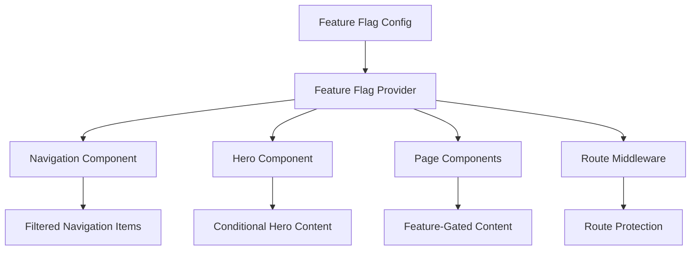

# Design Document

## Overview

The feature flag control mechanism will provide a centralized, type-safe system for managing the visibility of different website modules. The system will integrate seamlessly with the existing Next.js architecture, using React Context for state management and providing hooks for easy component integration.

## Architecture

### Core Components

1. **Feature Flag Configuration** - Centralized configuration file defining all available flags
2. **Feature Flag Context** - React Context provider for global state management
3. **Feature Flag Hook** - Custom hook for accessing flag values in components
4. **Navigation Integration** - Dynamic navigation filtering based on flags
5. **Hero Section Integration** - Conditional content rendering in hero sections
6. **Route Protection** - Middleware for protecting disabled feature routes

### Data Flow



## Components and Interfaces

### 1. Feature Flag Configuration

**File**: `lib/feature-flags.ts`

```typescript
export interface FeatureFlags {
  blog: boolean;
  projects: boolean;
  contact: boolean;
  about: boolean;
  analytics: boolean;
  rss: boolean;
}

export const defaultFeatureFlags: FeatureFlags = {
  blog: true,
  projects: true,
  contact: true,
  about: true,
  analytics: true,
  rss: false,
};

// Environment-based overrides
export const getFeatureFlags = (): FeatureFlags => {
  return {
    blog: process.env.NEXT_PUBLIC_FEATURE_BLOG !== 'false',
    projects: process.env.NEXT_PUBLIC_FEATURE_PROJECTS !== 'false',
    contact: process.env.NEXT_PUBLIC_FEATURE_CONTACT !== 'false',
    about: process.env.NEXT_PUBLIC_FEATURE_ABOUT !== 'false',
    analytics: process.env.NEXT_PUBLIC_FEATURE_ANALYTICS !== 'false',
    rss: process.env.NEXT_PUBLIC_FEATURE_RSS === 'true',
  };
};
```

### 2. Feature Flag Context Provider

**File**: `components/FeatureFlagProvider.tsx`

```typescript
interface FeatureFlagContextType {
  flags: FeatureFlags;
  isEnabled: (flag: keyof FeatureFlags) => boolean;
}

export const FeatureFlagContext = createContext<FeatureFlagContextType | null>(null);

export function FeatureFlagProvider({ children }: { children: React.ReactNode }) {
  const flags = useMemo(() => getFeatureFlags(), []);
  
  const isEnabled = useCallback((flag: keyof FeatureFlags) => {
    return flags[flag];
  }, [flags]);

  return (
    <FeatureFlagContext.Provider value={{ flags, isEnabled }}>
      {children}
    </FeatureFlagContext.Provider>
  );
}
```

### 3. Feature Flag Hook

**File**: `hooks/useFeatureFlag.ts`

```typescript
export function useFeatureFlag(flag: keyof FeatureFlags): boolean {
  const context = useContext(FeatureFlagContext);
  if (!context) {
    throw new Error('useFeatureFlag must be used within FeatureFlagProvider');
  }
  return context.isEnabled(flag);
}

export function useFeatureFlags(): FeatureFlags {
  const context = useContext(FeatureFlagContext);
  if (!context) {
    throw new Error('useFeatureFlags must be used within FeatureFlagProvider');
  }
  return context.flags;
}
```

### 4. Enhanced Navigation Component

The existing Navigation component will be enhanced to filter navigation items based on feature flags:

```typescript
// Enhanced navigationItems with feature flag mapping
export const navigationItems: NavigationItemWithFlag[] = [
  { label: 'Home', href: '/', flag: null }, // Always visible
  { label: 'About', href: '/about', flag: 'about' },
  { label: 'Projects', href: '/projects', flag: 'projects' },
  { label: 'Writing', href: '/writing', flag: 'blog' },
  { label: 'Contact', href: '/contact', flag: 'contact' },
];

// In Navigation component
const flags = useFeatureFlags();
const visibleItems = navigationItems.filter(item => 
  !item.flag || flags[item.flag]
);
```

### 5. Enhanced Hero Component

The Hero component will conditionally render content sections based on feature flags:

```typescript
export default function Hero() {
  const flags = useFeatureFlags();
  
  return (
    <section>
      {/* Main hero content */}
      
      {/* Conditional CTA buttons */}
      <div className="flex gap-4">
        {flags.projects && (
          <Link href="/projects">View My Work</Link>
        )}
        {flags.contact && (
          <Link href="/contact">Get In Touch</Link>
        )}
      </div>
      
      {/* Conditional featured sections */}
      {flags.blog && <FeaturedBlogSection />}
      {flags.projects && <FeaturedProjectsSection />}
    </section>
  );
}
```

### 6. Route Protection Middleware

**File**: `middleware.ts`

```typescript
export function middleware(request: NextRequest) {
  const flags = getFeatureFlags();
  const pathname = request.nextUrl.pathname;
  
  // Route to flag mapping
  const routeFlags: Record<string, keyof FeatureFlags> = {
    '/about': 'about',
    '/projects': 'projects',
    '/writing': 'blog',
    '/contact': 'contact',
  };
  
  // Check if route requires a feature flag
  for (const [route, flag] of Object.entries(routeFlags)) {
    if (pathname.startsWith(route) && !flags[flag]) {
      return NextResponse.redirect(new URL('/404', request.url));
    }
  }
  
  return NextResponse.next();
}

export const config = {
  matcher: ['/about/:path*', '/projects/:path*', '/writing/:path*', '/contact/:path*']
};
```

## Data Models

### Feature Flag Types

```typescript
export interface FeatureFlags {
  blog: boolean;
  projects: boolean;
  contact: boolean;
  about: boolean;
  analytics: boolean;
  rss: boolean;
}

export interface NavigationItemWithFlag extends NavigationItem {
  flag?: keyof FeatureFlags | null;
}

export interface FeatureFlagContextType {
  flags: FeatureFlags;
  isEnabled: (flag: keyof FeatureFlags) => boolean;
}
```

### Environment Variables

```env
# Feature Flags (default: true, set to 'false' to disable)
NEXT_PUBLIC_FEATURE_BLOG=true
NEXT_PUBLIC_FEATURE_PROJECTS=true
NEXT_PUBLIC_FEATURE_CONTACT=true
NEXT_PUBLIC_FEATURE_ABOUT=true
NEXT_PUBLIC_FEATURE_ANALYTICS=true
NEXT_PUBLIC_FEATURE_RSS=false
```

## Error Handling

### 1. Context Provider Errors
- Throw descriptive errors when hooks are used outside provider
- Provide fallback values for missing environment variables
- Log warnings for invalid flag configurations

### 2. Route Protection Errors
- Redirect to 404 page for disabled features
- Maintain proper HTTP status codes
- Preserve URL structure for SEO

### 3. Component Integration Errors
- Graceful degradation when flags are undefined
- Maintain layout integrity when sections are hidden
- Prevent broken navigation states

## Testing Strategy

### 1. Unit Tests
- Test feature flag configuration loading
- Test hook functionality with different flag states
- Test component conditional rendering

### 2. Integration Tests
- Test navigation filtering with various flag combinations
- Test route protection middleware
- Test hero section content variations

### 3. E2E Tests
- Test complete user flows with different flag configurations
- Test navigation behavior with disabled features
- Test direct URL access to disabled features

## Performance Considerations

### 1. Context Optimization
- Memoize flag values to prevent unnecessary re-renders
- Use callback memoization for flag checking functions
- Minimize context provider re-renders

### 2. Bundle Size
- Tree-shake unused flag-related code
- Lazy load feature-specific components
- Optimize environment variable processing

### 3. Runtime Performance
- Cache flag values during application lifecycle
- Minimize flag checking overhead in render loops
- Use efficient data structures for flag lookups

## Security Considerations

### 1. Client-Side Exposure
- Feature flags are exposed to client-side code
- Sensitive features should use server-side validation
- Environment variables are public in browser

### 2. Route Protection
- Server-side middleware provides primary protection
- Client-side checks are for UX only
- Implement proper authentication for sensitive features

### 3. Configuration Management
- Validate environment variable formats
- Provide secure defaults for production
- Log configuration changes for audit trails